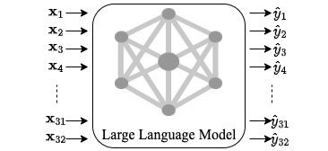
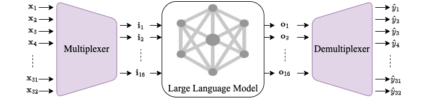
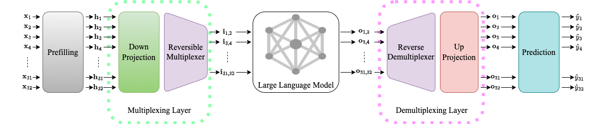
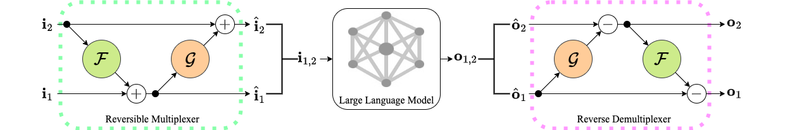

# RevMUX: Data Multiplexing with Reversible Adapters for Efficient LLM Batch Inference 

**Authors:** [Yige Xu](https://xuyige.github.io), [Xu Guo](https://guoxuxu.github.io/), [Zhiwei Zeng](https://scholar.google.com/citations?user=6eiLXmcAAAAJ), [Chunyan Miao](https://scholar.google.com/citations?user=fmXGRJgAAAAJ)

---

## Overview

The expansion of Large Language Models (LLMs) has driven breakthrough in Natural Language Processing (NLP) but raised concerns about <span style="color:blue">inference efficiency</span>, particularly latency, memory usage, and throughput.

<div style="display: flex; justify-content: center; gap: 20px; align-items: center;">
  <figure style="text-align: center; margin: 0;">
    
    <figcaption>Figure 1: Mini-Batch Processing with Single-Input Single-Output (SISO)</figcaption>
  </figure>
  
  <figure style="text-align: center; margin: 0;">
    
    <figcaption>Figure 2: Multi-Input Multi-Output (MIMO) with data multiplexing and demultiplexing</figcaption>
  </figure>
</div>

Our work addresses the need of <b><span style="color:red">high throughput</span></b> through <b><span style="color:red">data multiplexing</span></b>, handling batches of concurrent queries while maintaining satisfactory downstream performance.

We fixed the backbone language models and tunes the adapters only. Then we design a reversible adapter to mix the instances and perform a reverse operation to reconstruct the individual outputs.

<div style="text-align: center;">
  
  <br>
  <figcaption>Figure 3: Overview of Our RevMUX</figcaption>
</div>

<div style="text-align: center;">
  
  <br>
  <figcaption>Figure 4: Illustration of the reversible multiplexer and reverse demultiplexer when N=2.</figcaption>
</div>


## Quick Start

### Setup and Dependencies

Requirements:

- fastNLP==0.7.0
- torch==2.3.1+cu118
- transformers==4.42.3

### Data Preparation

The dataset should be downloaded under the same directory:

```
/path/to/your/data/dir
    |--/MRPC/
        |--/dev.tsv
        |--/test.tsv
        |--/train.tsv
    |--/QNLI/
        |--/dev.tsv
        |--/test.tsv
        |--/train.tsv
    |--/RTE/
        |--/dev.tsv
        |--/test.tsv
        |--/train.tsv
    |--/SST-2/
        |--/dev.tsv
        |--/test.tsv
        |--/train.tsv
```


### Usage

#### T5

```bash
bash run_batch_inference_t5.sh  \
    --task_name sst-2 \
    --model_name t5-small \
    --model_type revmux \
    --batch_size 32 \
    --n_epochs 50 \
    --combine_first 3 \
    --compose_size 2 \
    --data_dir /path/to/your/data/dir \
    --adapter_lr 2e-5 \
    --save_dir /path/to/you/save/dir
```

#### BERT

```bash
bash run_batch_inference_bert.sh  \
    --task_name sst-2 \
    --model_name bert-base-uncased \
    --model_type revmux \
    --batch_size 32 \
    --n_epochs 50 \
    --combine_first 6 \
    --compose_size 2 \
    --data_dir /path/to/your/data/dir \
    --adapter_lr 2e-5 \
    --save_dir /path/to/you/save/dir
```

#### LLaMA
```bash
bash run_batch_inference_llama.sh  \
    --task_name sst-2 \
    --model_name /path/to/your/llama3 \
    --model_type revmux \
    --batch_size 2 \
    --n_epochs 10 \
    --combine_first 16 \
    --compose_size 2 \
    --data_dir /path/to/your/data/dir \
    --adapter_lr 2e-5 \
    --save_dir /path/to/you/save/dir
```

**Arguments**: 

`task_name` is selected from `[sst-2, rte, qnli, mrpc]`.

`model_name` is the name of backbone language model, selected from `[t5-small, t5-base, t5-large, bert-base-uncased]`.

`model_type`: `revmux` is our **RevMUX**, `ora` is the baseline of **Only Multiplexer Reversible**, `adapter` is the baseline of **Vanilla Adapters**.

`combine_first`: the number of prefilling layers.

`compose_size`: the number of instances mixed together.


